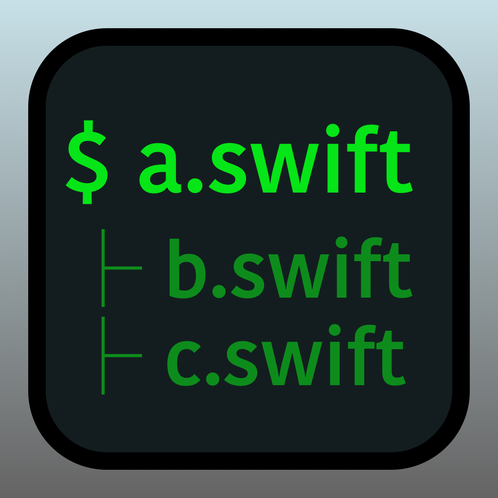

# Swift import

A CLI tool that resolves import statements in Swift scripts — enabling file and folder-level inclusion to improve Swift scripting ergonomics.



### Introduction

Given a scripting project structured as follows:

```
/b.swift
    func b() { print("b") }

/folder
    |- c.swift
        func c() { print("c") }
    |- d.swift
        func d() { print("d") }
    
/a.swift
    // import b.swift
    // import /folder
    
    b()
    c()
    d()
```

When running:

```bash
$ swiftimport a.swift 
```

Will resolve all imports and return a single concatenated file:

```
func b() { print("b") }
func c() { print("c") }
func d() { print("d") }

b()
c()
d()
```

Then you can pass the concatenation to the compilar to run the code:

```
tmp_file="swiftimport-$(date +"%Y%m%d-%H%M%S").swift"
swiftimport --input "$1" > "$tmp_file"
swift "$tmp_file"
rm "$tmp_file"
```

### Use cases

- Quick explorations and playgrounds
- Small sized projects without Xcode
- Expanding Swift scripting

### Usage

Add this run script to your IDE/Text editor or run directly from terminal:

```bash
tmp_file="swiftimport-$(date +"%Y%m%d-%H%M%S").swift"
swiftimport --input "$1" > "$tmp_file"
swift "$tmp_file"
rm "$tmp_file"
```


https://github.com/user-attachments/assets/39679225-4540-4147-b221-8237fc70ec5c


#### CodeRunner

If the swiftimport binary is in your $PATH, you can add preprocessing to your Swift compile script in CodeRunner:

```bash
[ -z "$CR_SUGGESTED_OUTPUT_FILE" ] && CR_SUGGESTED_OUTPUT_FILE="$PWD/${CR_FILENAME%.*}"

# Check if Xcode is installed
xcrun swiftc &>/dev/null
status=$?
if [ $status -eq 69 ]; then
    echo "To run swift code you need to open Xcode and accept the developer license agreement."
    exit 69
else
    if [ "$CR_FILENAME" = "main.swift" ]; then
        xcrun -sdk macosx swiftc -o "$CR_SUGGESTED_OUTPUT_FILE" *.swift "${@:1}" ${CR_DEBUGGING:+-g}
    else
        TMP_SWIFT="$CR_TMPDIR/swiftimport-$(date +"%Y%m%d-%H%M%S").swift"
        swiftimport --input "$CR_FILENAME" > "$TMP_SWIFT"
        xcrun -sdk macosx swiftc -o "$CR_SUGGESTED_OUTPUT_FILE" "$TMP_SWIFT" "${@:1}" ${CR_DEBUGGING:+-g}
    fi
    status=$?
fi

if [ $status -eq 0 ]; then
    echo "$CR_SUGGESTED_OUTPUT_FILE"
fi
exit $status
```


https://github.com/user-attachments/assets/508ba6d8-7221-4a78-b99d-02ed00921337


### Installation

Clone repo and build binary:

```bash
swift build -c release
```

Then optionally move the binary to your global path:

```bash
sudo mv .build/release/swiftimport /usr/local/bin
```
So you can run it from anywhere with:

```bash
$ swiftimport --input yourfile.swift
```
